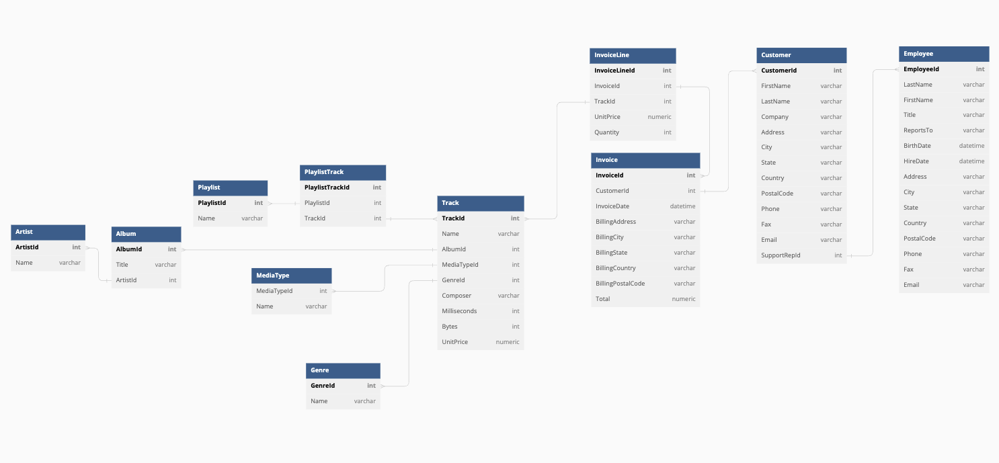

# chinook-macleann

## Book 4
- https://github.com/nashville-software-school/bangazon-llc/blob/cohort-62/book-4-bangazon/chapters/CHINOOK.md

## Setup
- download the DB above
- In your Terminal, create a new project directory for your work.
- `mkdir -p ~/workspace/chinook`
- Navigate to the directory where the database was downloaded. It should be something like the following:
- `cd ~/Downloads`
- Move the `Chinook_Sqlite.sqlite` file into your project directory.
- `cp Chinook_Sqlite.sqlite ~/workspace/chinook`
- NOTE: That file IS the database. It contains all of the tables and data.
- Open your project directory in VS Code.
- `code ~/workspace/chinook`
- Create a connection to the database file. AKA `cmd+shift+p` and select DB
- [Windows setup shenanigans](https://github.com/nashville-software-school/bangazon-llc/blob/cohort-62/book-4-bangazon/chapters/CHINOOK_WINDOWS_MOVE_DB.md)
- [SQLite Documentation](https://www.sqlite.org/index.html)

## ERD
- [dbDiagram](https://dbdiagram.io/d/646e3834dca9fb07c4b36f64)
